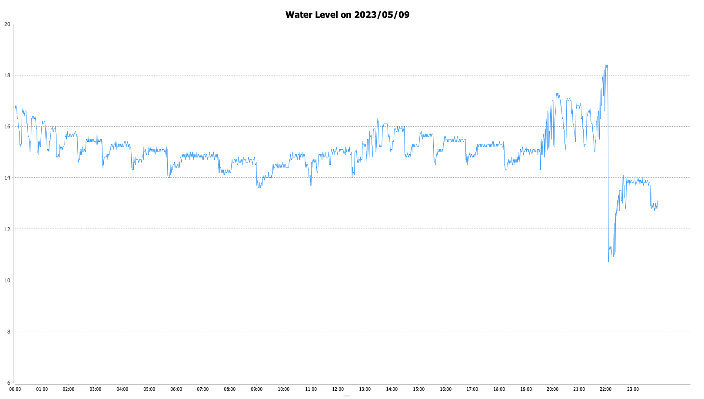

# Sump Data Visulalizer Command Line Tool
This is a Java application that generates charts as a PNG file form sump data in CSV file format.

This is similar to my [SumpChart project](https://github.com/nobudev7/sumpchart). As oppose to the SumChart, which takes data from a REST endpoint and running as a webserver to show visualization, it takes a local input folder, generates PNG files, then write to the output folder.

## Environments
- Java 21

## Libraries
- JFreeChart
- Apache Commons Cli

